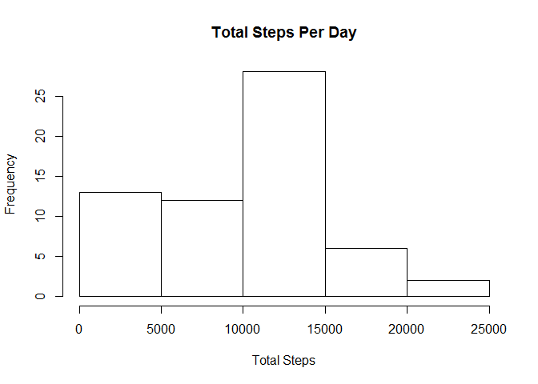
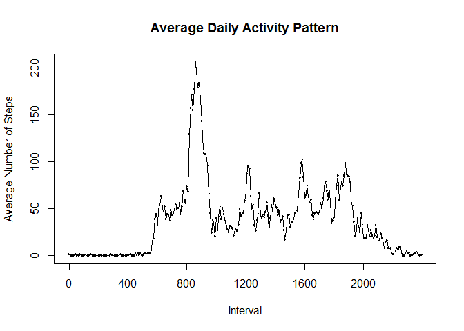
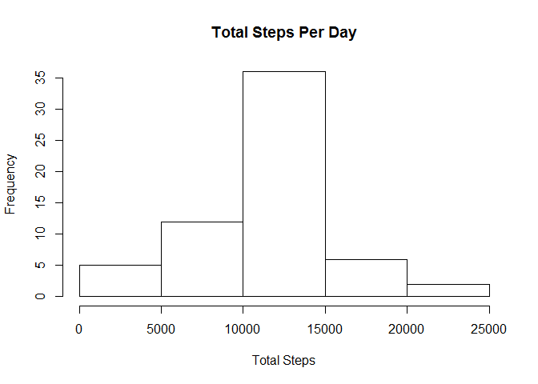
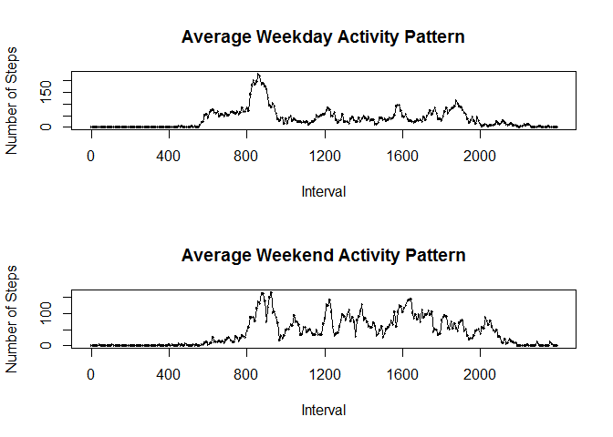

# Reproducible Research: Peer Assessment 1
***
### Loading and pre-processing the data
#### Data source
All data used in the following exercises was obtained from the Reproducible Research course website, at the following URL: <https://d396qusza40orc.cloudfront.net/repdata%2Fdata%2Factivity.zip>.  The data was then downloaded and unzipped to the authors R working directory.

#### R libraries
Before starting the analysis we want to make sure that we have included the necessary R libraries (output surpressed):

```r
library(plyr)
library(dplyr)
library(lubridate)
```

#### Read data file
First we read and store the activity data file from the working directory:

```r
activity <- read.csv("activity.csv")
```
#### Process activity data
Our first step is to convert the interval data to factors so that our plots will be linear (interval data jumps from 55 to 100, so if plotted as integers gives incorrect results).  All times are represented as military time, with no colon.

```r
activity$interval <- as.factor(activity$interval)
```
### What is mean total number of steps taken per day?
We then group total number of steps per day:

```r
activity_by_date <- group_by(activity, date)
activity_sum_steps <- summarize(activity_by_date, sum(steps, na.rm=TRUE))
names(activity_sum_steps) <- c("date", "steps")
```
#### As a histogram

```r
hist(as.numeric(as.character(activity_sum_steps$steps)), main="Total Steps Per Day", xlab = "Total Steps")
```

 

#### Calculated mean total number of steps

```r
mean(activity_sum_steps$steps)
```

```
## [1] 9354
```

#### Calculated median total number of steps

```r
median(activity_sum_steps$steps)
```

```
## [1] 10395
```

### What is the average daily activity pattern?
#### Re-arrange activity data set by interval
In order to examine the average daily activity pattern, we need to first re-arrange the data by interval, using the average step count for each:

```r
activity_by_interval <- group_by(activity, interval)
activity_avg_interval <- summarize(activity_by_interval, mean(steps, na.rm=TRUE))
names(activity_avg_interval) <- c("interval", "steps")
```

#### Time series plot of average steps

```r
plot(activity_avg_interval$interval, activity_avg_interval$steps, type="l", main="Average Daily Activity Pattern", xlab="Interval", ylab="Average Number of Steps", xaxt = 'n')
lines(activity_avg_interval$interval, activity_avg_interval$steps)
axis(1, at=seq(1,288,48), labels=activity_avg_interval$interval[seq(1,288,48)])
```

 

#### 5-minute interval containing maximum steps
As can be estimated from the time-series plot, the time interval at which the average daily steps is maximum is at 835.

```r
max_inter <- activity_avg_interval[activity_avg_interval$steps==max(activity_avg_interval$steps),]
as.numeric(as.character(max_inter$interval))
```

```
## [1] 835
```

### Imputing missing values
#### Total number of missing values

```r
sum(is.na(activity$steps))
```

```
## [1] 2304
```
#### Fill missing values
In order to fill the missing values in the data set, I decided to use the average values for the interval during which those values were missing.  The first step was then to add the average interval data to the original data set:

```r
activity_fill_NA <- merge(activity, activity_avg_interval, "interval")
```
Then fill the NA values in the original data set with the average interval data:

```r
steps_orig <- activity_fill_NA$steps.x
steps_avg <- activity_fill_NA$steps.y
steps_avg[!is.na(steps_orig)] = 0
steps_orig[is.na(steps_orig)] = 0
activity_fill_NA$steps <- steps_avg + steps_orig
```
#### Create new data set
Finally clean up the data frame to remove original and average values, leaving just the merged column.  This should result in a new data set which is equal to the original, with the missing values filled in:

```r
activity_fill_NA$steps.x <- NULL
activity_fill_NA$steps.y <- NULL
```
#### Total number of steps taken each day
In order to plot a histogram, we take the same steps as above, and group total number of steps per day:

```r
activity_fill_by_date <- group_by(activity_fill_NA, date)
activity_fill_sum_steps <- summarize(activity_fill_by_date, sum(steps, na.rm=TRUE))
names(activity_fill_sum_steps) <- c("date", "steps")
```
Then create the histogram of total number of steps per day:

```r
hist(as.numeric(as.character(activity_fill_sum_steps$steps)), main="Total Steps Per Day", xlab = "Total Steps")
```

 

Calculated mean total number of steps:

```r
mean(activity_fill_sum_steps$steps)
```

```
## [1] 10766
```
Calculated median total number of steps:

```r
median(activity_fill_sum_steps$steps)
```

```
## [1] 10766
```
By filling the missing values in the data set, we have significantly raised the value of the mean number of steps per day (approximately 15%), and the median number of steps per day (approximately 4%).  The mean and median values are now equal, whereas previously they were quite different.

### Are there differences in activity patterns between weekdays and weekends?

#### Create new factor for weekend/weekday:
The first step towards analyzing the differences between weekday and weekend activity is to add an additional factor variable to distinguish type of day:

```r
activity_fill_NA$weekday <- weekdays(ymd(activity_fill_NA$date))
activity_fill_NA$weekday <- gsub("Monday", "weekday", activity_fill_NA$weekday)
activity_fill_NA$weekday <- gsub("Tuesday", "weekday", activity_fill_NA$weekday)
activity_fill_NA$weekday <- gsub("Wednesday", "weekday", activity_fill_NA$weekday)
activity_fill_NA$weekday <- gsub("Thursday", "weekday", activity_fill_NA$weekday)
activity_fill_NA$weekday <- gsub("Friday", "weekday", activity_fill_NA$weekday)
activity_fill_NA$weekday <- gsub("Saturday", "weekend", activity_fill_NA$weekday)
activity_fill_NA$weekday <- gsub("Sunday", "weekend", activity_fill_NA$weekday)
activity_fill_NA$weekday <- as.factor(activity_fill_NA$weekday)
```
#### Panel plot of average steps
We first re-arrange activity data by interval and weekday:

```r
activity_fill_by_interval <- group_by(activity_fill_NA, interval, weekday)
activity_fill_avg_interval <- summarize(activity_fill_by_interval, mean(steps, na.rm=TRUE))
names(activity_fill_avg_interval) <- c("interval", "weekday", "steps")
```
We then create our panel plot that compares weekday and weekend average interval activity data:

```r
par(mfrow=c(2,1))
plot(activity_fill_avg_interval$interval[activity_fill_avg_interval$weekday == "weekday"], activity_fill_avg_interval$steps[activity_fill_avg_interval$weekday == "weekday"], type="l", main="Average Weekday Activity Pattern", xlab="Interval", ylab="Number of Steps", xaxt = 'n')
lines(activity_fill_avg_interval$interval[activity_fill_avg_interval$weekday == "weekday"], activity_fill_avg_interval$steps[activity_fill_avg_interval$weekday == "weekday"])
axis(1, at=seq(1,288,48), labels=activity_avg_interval$interval[seq(1,288,48)])
plot(activity_fill_avg_interval$interval[activity_fill_avg_interval$weekday == "weekend"], activity_fill_avg_interval$steps[activity_fill_avg_interval$weekday == "weekend"], type="l", main="Average Weekend Activity Pattern", xlab="Interval", ylab="Number of Steps", xaxt = 'n')
lines(activity_fill_avg_interval$interval[activity_fill_avg_interval$weekday == "weekend"], activity_fill_avg_interval$steps[activity_fill_avg_interval$weekday == "weekend"]) 
axis(1, at=seq(1,288,48), labels=activity_avg_interval$interval[seq(1,288,48)])
```

 
